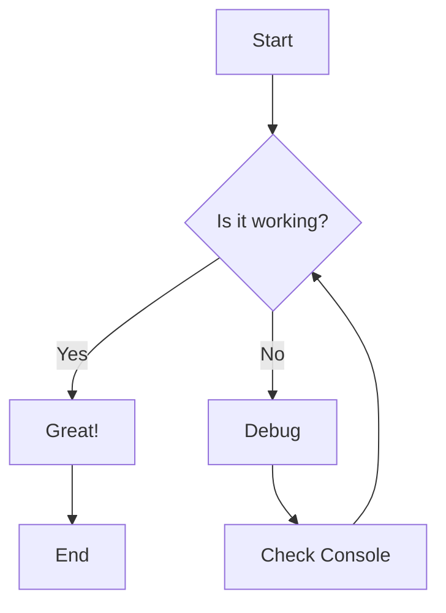
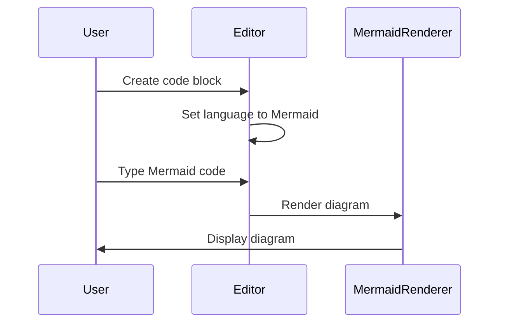
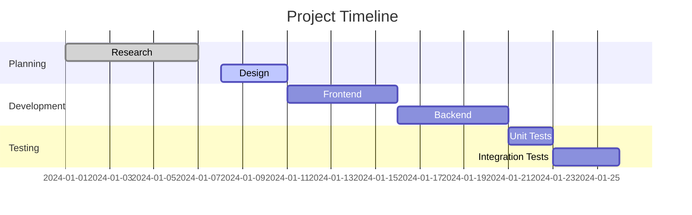

# Mermaid Diagram Test

Below is a simple Mermaid flowchart. In the Rich Text editor, you should:

1. Create a code block
2. Select "Mermaid" as the language
3. Paste the Mermaid code

## Example Flowchart



## Example Sequence Diagram



## Example Gantt Chart



## How to use in the editor:

1. Switch to Rich Text mode
2. Add a code block (using the toolbar or by typing ```)
3. Click on the language selector (default is "Plain Text")
4. Choose "Mermaid" from the dropdown
5. Paste any of the Mermaid code examples above
6. You should see both the code and a rendered diagram preview below it